# Dinobase

dinobase는 deno kv와 fresh를 사용하는 간단한 백엔드 소프트웨어입니다.

## 로컬에서 사용

```bash
git clone https://github.com/ddtt786/dinobase.git
cd dinobase
deno task build
deno task production
```

## deno deploy에서 사용

dinobase github repository를 포크하고 사용하면 됩니다.

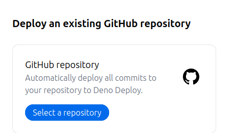

deno kv 사용을 신청해서 deno kv를 사용할 수 있는 상태여야 하며, file storage를
이용할 수 없습니다.

## 개념

- note
  - 같은 구조를 가지는 sheet를 모아 두는 공간입니다. (sql의 table과 비슷합니다)
- sheet
  - column을 기반으로 구조를 가지는 오브젝트입니다.
  - 각각의 sheet는 고유의 uuid를 가집니다.
- column
  - 데이터 제약 사항을 정의하는 오브젝트입니다. (스프레드시트의 열과
    비슷합니다.)
  - `관계`를 가질 경우 note에 sheet를 추가할 때 sheet에서 관계를 가지고 있는
    column에 해당하는 값이 관계를 가진 note에서 존재해야 합니다. (예를 들어,
    어떤 column의 관계 값이 `account`이고 sheet에서 해당 column에 해당하는 값이
    `7a6ca7bc-2446-4d49-b35e-54ca21f7db2b` 일 경우, account note에
    `7a6ca7bc-2446-4d49-b35e-54ca21f7db2b`를 uuid로 가지는 sheet가 있어야
    합니다. column의 관계 값이 `account,username`이고 sheet에서 해당 column에
    해당하는 값이 `asdf`일 경우, account note에 username column 값이 `asdf`인
    sheet가 있어야 합니다.)

## 관리자 패널

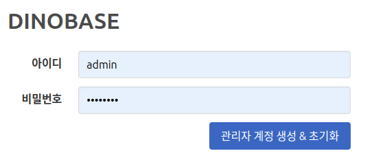

dinobase를 init 하기 전에는 dinobase를 사용할 수 없습니다. `host:3000/signup`
으로 접속해 관리자 계정을 생성하고 초기화하세요.

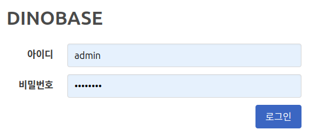

초기화 후 로그인 하시면 됩니다. (초기화 후 리다이렉트 되지 않는 경우
`host:3000/signin` 으로 이동하세요.)

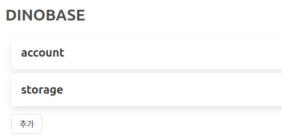

`추가` 버튼을 클릭하여 노트를 추가할 수 있습니다.

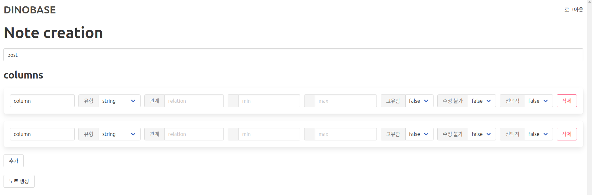

`추가` 버튼을 눌러 컬럼을 추가하세요.

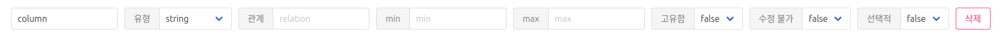

컬럼의 옵션은 다음과 같습니다.

- `column_name` 컬럼의 이름입니다.
- `유형` 컬럼의 유형입니다. 사용할 수 있는 컬럼의 유형은 다음과 같습니다.
  - `string` 문자열 유형입니다.
  - `number` 숫자 유형입니다.
  - `boolean` 참/거짓 유형입니다.
  - `file` 파일을 가리킵니다.
  - `timestamp` timestamp 유형입니다. sheet가 생성될 때 자동으로 생성됩니다.
    (Date.now())
  - `auth` 하나의 사용자의 계정을 가리킵니다. sheet를 추가하고, 읽고, 수정하고,
    삭제할 때 sheet에서 해당 column에 해당하는 값이 행동을 하는 사용자와 같은지
    자동으로 확인합니다. (즉, 사용자가 값을 마음대로 조작할 수 없습니다.)
- `관계` 컬럼의 관계입니다.
- `min` 컬럼의 유형이 string인 경우 최소 길이를, number인 경우 최소 값을
  의미합니다.
- `max` 컬럼의 유형이 string인 경우 최대 길이를, number인 경우 최대 값을
  의미합니다.
- `고유함` sheet에서 해당 컬럼에 해당하는 값이 다른 sheet에 없음을 의미합니다.
  (절대 값이 겹치면 안되는 컬럼에 사용하면 좋습니다.)
- `수정 불가` sheet를 추가한 후 이 컬럼에 해당하는 값은 다시 수정할 수 없음을
  의미합니다.
- `선택적` sheet를 추가할 때 이 column에 해당하는 값이 없어도 됨을 의미합니다.

유저의 post를 저장하는 note를 만들고 싶다면 columns는 다음과 같을 것입니다.

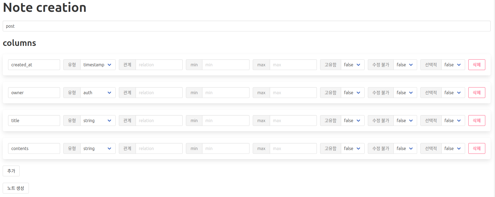

`노트 생성` 버튼을 눌러 노트를 생성합니다.

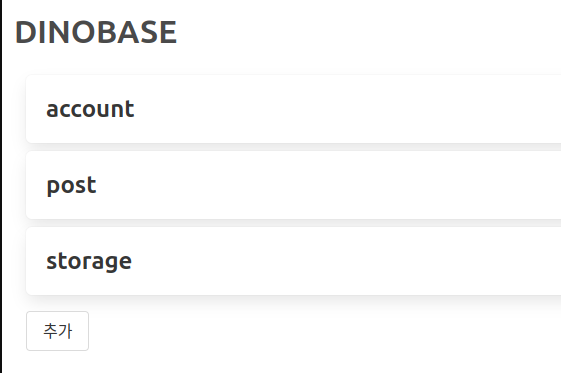

노트가 생성된 것을 확인할 수 있습니다. 노트를 수정하려면 수정하고 싶은 노트를
클릭하세요.

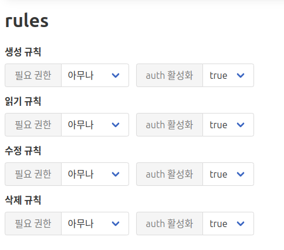

규칙을 수정할 수 있습니다.

- 읽기 규칙에서 auth를 활성화하면 sheet를 추가한 사용자만 해당 sheet를 읽을 수
  있기 때문에 비활성화 하는 것이 좋습니다..

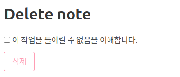

최하단에서 노트를 삭제할 수 있습니다. 노트를 삭제할 경우 해당 노트에 저장된 모든
sheet가 없어지기 때문에 주의해야 합니다.

## sdk 사용

dinobase 설정을 마쳤다면 sdk를 사용할 수 있습니다. (자세한 사용법은
[여기](https://github.com/ddtt786/dinobasesdk)서 확인할 수 있습니다.)

npm (또는 esm)으로 설치합니다.

```
npm i dinobase
```

- 예제

```js
import { dinobase } from "dinobase";

const dino = dinobase("http://localhost:3000");

await dino.auth.signIn("admin", "testtest");

await dino.note("post").insert({
  owner: dino.auth.uuid,
  title: "hello!",
  contents: "lorem ipsum",
});

const list = await dino.note("post").search("title", {
  limit: 10,
}); // search를 사용하려면 읽기 규칙에서 auth 활성화를 false로 설정해야 합니다.

console.log(await dino.note("post").getOne(list.data[0]));
```

- 결과

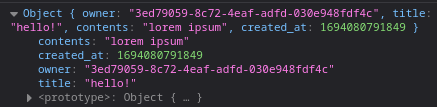
